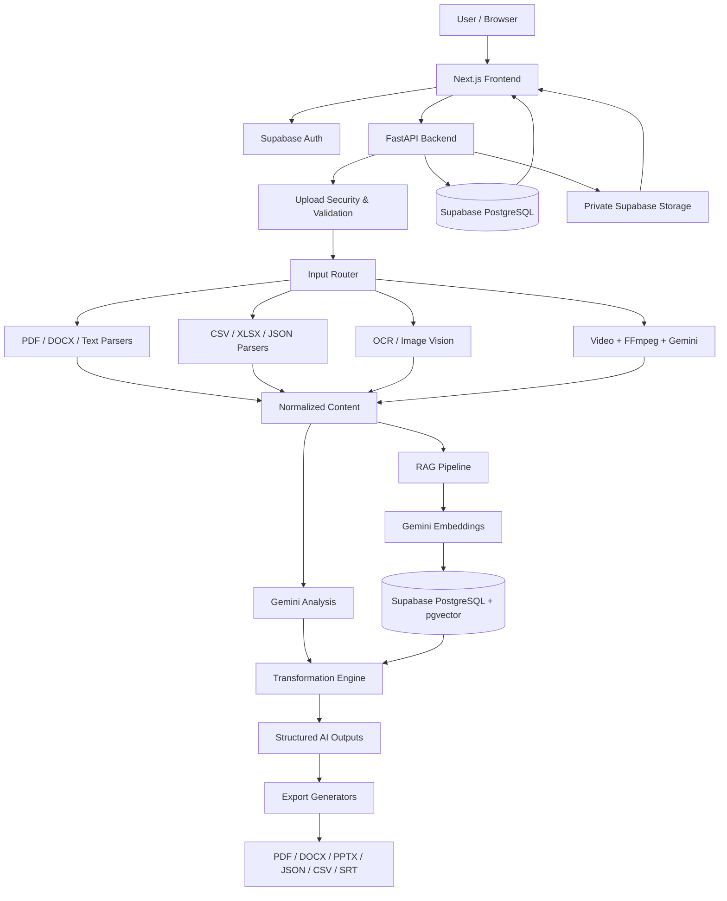

# TransformAI — GenAI Content Transformation Platform

> **Smart India Hackathon 2026 · Problem Statement SIH26154 · NTRO · Software**

TransformAI is a secure, full-stack Generative AI platform that converts unstructured and multimodal source content into structured, audience-ready communication assets. It accepts text, documents, images, tabular data, and video, analyzes the source with Gemini-powered AI and Retrieval-Augmented Generation (RAG), and generates multiple professional output formats with export support.

---

## Problem Statement

**SIH 2026 — SIH26154**
**Title:** Gen AI Platform for Automated Content Transformation
**Organization:** NTRO
**Category:** Software

The project focuses on transforming heterogeneous content into useful communication formats while preserving context, accuracy, traceability, security, and usability.

---

## What TransformAI Does

TransformAI provides a complete workflow:

1. Upload a file or enter text.
2. Validate and parse the source securely.
3. Extract and normalize content.
4. Analyze the source using Gemini.
5. Optionally retrieve relevant source context using RAG.
6. Configure audience, tone, language, detail level, and objective.
7. Generate one or more communication assets.
8. Review structured outputs.
9. Export results into professional file formats.
10. Track documents, history, analytics, and activity.

---

## Supported Inputs

- Plain text / prompts
- PDF
- DOCX
- TXT / Markdown
- JSON
- CSV
- XLSX
- Images
  - PNG
  - JPG / JPEG
  - WEBP
  - BMP
  - TIFF
- Video
  - MP4
  - MOV
  - WEBM

---

## Transformation Controls

Users can configure:

- Target audience
- Tone
- Output language
- Detail level
- Communication objective
- Custom instructions
- RAG enabled / disabled

---

## Generated Output Types

TransformAI supports:

- Executive Summary
- Detailed Summary
- Advisory
- LinkedIn Post
- X Thread
- Infographic Blueprint
- Presentation Content
- Video Script
- Action Items
- Structured Data

---

## Export Formats

Generated content can be exported as:

- PDF
- DOCX
- PPTX
- JSON
- CSV
- SRT

Private export files are delivered through signed download URLs.

---

## Core Features

### Multimodal Content Ingestion

The platform routes different source types through dedicated ingestion services for:

- text extraction
- document parsing
- OCR / image understanding
- tabular parsing
- video processing

### AI Content Intelligence

The Gemini-based analysis pipeline can derive:

- inferred title
- content type
- one-line summary
- executive context
- key topics
- important metrics
- evidence
- confidence-oriented analysis

### Retrieval-Augmented Generation

The RAG pipeline includes:

- source chunking
- Gemini embeddings
- PostgreSQL + pgvector
- vector similarity search
- source-grounded retrieval
- user-isolated RAG data

### Structured Generation

AI output is generated with structured schemas and validated before being returned to the application.

### Professional Export Center

Generated results can be converted into multiple document and data formats from a single transformation.

---

## Application Modules

- Landing Page
- Authentication
- Dashboard
- Transform Studio
- Documents
- Document Detail
- History
- Analytics
- Results Workspace
- Structured Content Viewer
- Export Center
- Settings
- Responsive App Shell
- Light / Dark Theme
- Loading States
- Error States
- 404 Page

---

## System Architecture



---

## Technology Stack

### Frontend

- Next.js 16
- React
- TypeScript
- App Router
- Tailwind CSS 4
- shadcn/ui / Base UI primitives
- TanStack Query
- Recharts
- Supabase Auth
- Lucide React
- Sonner

### Backend

- Python 3.12
- FastAPI
- Uvicorn
- Pydantic
- Google GenAI SDK
- Gemini
- FFmpeg
- PyMuPDF
- python-docx
- Pandas
- OCR / image processing services

### Data & Infrastructure

- Supabase PostgreSQL
- Supabase Auth
- Supabase Private Storage
- pgvector
- HNSW cosine similarity indexing
- Row Level Security
- Signed URLs

---

## Security

Security is a core part of TransformAI.

Implemented protections include:

- Supabase authentication
- Backend JWT validation
- Per-user authorization
- PostgreSQL Row Level Security
- Private storage buckets
- User-scoped storage paths
- MIME validation
- File size validation
- Suspicious file signature checks
- Filename sanitization
- Rate limiting
- Request IDs
- Controlled CORS
- Signed export URLs
- Environment-based secrets
- Sanitized API/provider errors
- User-isolated documents, transformations, exports, and RAG chunks

---

## AI Reliability & Safety

The AI pipeline includes:

- structured JSON generation
- Pydantic validation
- prompt versioning
- retry handling for recoverable failures
- clean provider error handling
- hierarchical analysis for large sources
- RAG-based source grounding
- evidence and provenance support
- confidence-oriented analysis
- schema-controlled transformation outputs

---

## Project Structure

```text
SIH26154-GenAI-Content-Transformation/
│
├── backend/
│   ├── app/
│   ├── scripts/
│   ├── sql/
│   ├── tests/
│   ├── requirements.txt
│   ├── .env.example
│   └── README.md
│
├── frontend/
│   ├── src/
│   ├── public/
│   ├── package.json
│   └── README.md
│
├── README.md
└── .gitignore
```

---

## Local Development

### Prerequisites

Install:

- Git
- Node.js
- npm
- Python 3.12
- FFmpeg
- A Supabase project
- A Gemini API key

---

## Backend Setup

```powershell
cd backend

py -3.12 -m venv .venv
.\.venv\Scripts\Activate.ps1

pip install -r requirements.txt
```

Create:

```text
backend/.env
```

Use:

```text
backend/.env.example
```

as the source of truth for required variables.

Run:

```powershell
uvicorn app.main:app --reload
```

Backend:

```text
http://localhost:8000
```

API docs:

```text
http://localhost:8000/docs
```

---

## Frontend Setup

```powershell
cd frontend
npm install
```

Create:

```text
frontend/.env.local
```

Configure the required public frontend environment values.

Run:

```powershell
npm run dev
```

Frontend:

```text
http://localhost:3000
```

---

## Frontend Quality Checks

```powershell
npx tsc --noEmit
npm run lint
npm run build
```

The finalized frontend passed TypeScript, ESLint, and the Next.js production build locally.

---

## Recommended Demo Flow

```text
Login
  ↓
Transform Studio
  ↓
Upload PDF / DOCX / Image / XLSX / Video
  ↓
Prepare Source
  ↓
Enable RAG
  ↓
Choose Audience + Tone + Language + Detail
  ↓
Select Output Types
  ↓
Generate Transformation
  ↓
Review Results
  ↓
Generate PDF / DOCX / PPTX / JSON / CSV / SRT
  ↓
Download Export
  ↓
Documents / History / Analytics
```

---

## Tested Capabilities

The project has been locally tested with:

- Text
- PDF
- DOCX
- Image / OCR
- CSV
- XLSX
- JSON
- Video
- RAG retrieval
- All 10 transformation output types
- PDF export
- DOCX export
- PPTX export
- JSON export
- CSV export
- SRT export
- Authentication
- User isolation
- Private storage
- Analytics
- Production frontend build

---

## Deployment

Planned production setup:

- **Frontend:** Vercel
- **Backend:** Production service with Python 3.12 and FFmpeg support
- **Database / Auth / Storage:** Supabase

### Live Application

```text
Coming after production deployment.
```

### Production API Documentation

```text
Coming after production deployment.
```

After deployment, replace the placeholders above with the final live URLs.

---

## Developer

**Ayush Kumar Singh**
MCA — Lloyd Institute of Engineering & Technology, Greater Noida
Smart India Hackathon 2026 Project

---

## Repository Safety Notes

- Never commit `backend/.env`.
- Never commit `frontend/.env.local`.
- Keep private Supabase and Gemini secrets server-side.
- Use `.env.example` only for variable names and placeholder values.
- Production video support requires FFmpeg in the backend runtime.
