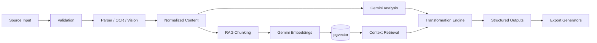

# TransformAI Backend

Backend service for **TransformAI — GenAI Content Transformation Platform**, developed for **Smart India Hackathon 2026 · SIH26154**.

The backend is responsible for secure content ingestion, parsing, AI analysis, Retrieval-Augmented Generation, transformations, exports, analytics, storage, and user-isolated data access.

---

## Tech Stack

- Python 3.12
- FastAPI
- Uvicorn
- Pydantic
- Google GenAI SDK
- Gemini
- Supabase
- PostgreSQL
- pgvector
- FFmpeg
- PyMuPDF
- python-docx
- Pandas
- OCR / vision processing
- PDF / DOCX / PPTX / CSV / JSON / SRT generators

---

## Backend Responsibilities

The service handles:

- authentication-aware API access
- document ingestion
- upload validation
- MIME validation
- file signature checks
- filename sanitization
- text extraction
- PDF parsing
- DOCX parsing
- image / OCR processing
- tabular parsing
- video preprocessing and AI understanding
- content normalization
- Gemini-based analysis
- structured AI generation
- hierarchical analysis for large sources
- RAG indexing
- vector similarity search
- transformation generation
- professional exports
- signed download URLs
- dashboard and analytics data
- rate limiting
- request tracking
- error sanitization

---

## Supported Inputs

```text
Text
PDF
DOCX
TXT / Markdown
JSON
CSV
XLSX
PNG / JPG / JPEG / WEBP / BMP / TIFF
MP4 / MOV / WEBM
```

Maximum upload size is controlled by backend configuration.

---

## Transformation Outputs

The transformation engine supports:

- Executive Summary
- Detailed Summary
- Advisory
- LinkedIn Post
- X Thread
- Infographic Blueprint
- Presentation Content
- Video Script
- Action Items
- Structured Data

---

## Export Formats

The export system supports:

- PDF
- DOCX
- PPTX
- JSON
- CSV
- SRT

Generated export files are stored privately and delivered through signed URLs.

---

## AI Pipeline



---

## RAG Architecture

The RAG pipeline includes:

- configurable chunking and overlap
- Gemini embedding generation
- PostgreSQL vector storage
- HNSW cosine similarity indexing
- user-scoped retrieval
- similarity filtering
- context injection into transformations

RAG data is isolated per authenticated user.

---

## Gemini Integration

The backend uses the Google GenAI SDK for structured generation.

The AI integration includes:

- schema-constrained JSON responses
- Pydantic validation
- structured retry handling
- provider-specific error handling
- quota / rate limit handling
- large-source hierarchical analysis
- prompt versioning
- evidence-aware outputs
- confidence-oriented analysis

Model selection is controlled through environment variables.

---

## Video Processing

Video support uses:

- FFmpeg / FFprobe
- Gemini video understanding
- temporary provider file upload where required
- cleanup after processing

**FFmpeg is required in the production runtime** if video ingestion is enabled.

---

## Security

The backend includes production-oriented security controls such as:

- JWT validation
- Supabase Auth integration
- per-user authorization
- PostgreSQL Row Level Security
- private storage
- user-scoped storage paths
- MIME validation
- maximum upload limits
- suspicious executable signature checks
- sanitized filenames
- rate limiting
- request IDs
- CORS restrictions
- signed export URLs
- environment-based secrets
- sanitized provider/API errors

Secrets must never be committed to Git.

---

## Database & Storage

Supabase is used for:

- PostgreSQL
- Authentication
- Private Storage
- Row Level Security
- pgvector-based RAG

Important data domains include:

- profiles
- source documents
- transformations
- generated outputs
- exported files
- RAG chunks
- activity events
- API rate limits

---

## Project Structure

```text
backend/
│
├── app/
│   ├── api/
│   │   └── v1/
│   ├── core/
│   ├── middleware/
│   ├── schemas/
│   ├── services/
│   │   ├── ai/
│   │   ├── analysis/
│   │   ├── generators/
│   │   ├── ingestion/
│   │   ├── management/
│   │   ├── ocr/
│   │   ├── rag/
│   │   └── storage/
│   ├── utils/
│   └── main.py
│
├── scripts/
├── sql/
├── tests/
├── requirements.txt
├── .env.example
└── README.md
```

---

## Local Setup

### 1. Create virtual environment

```powershell
cd backend

py -3.12 -m venv .venv
.\.venv\Scripts\Activate.ps1
```

### 2. Install dependencies

```powershell
pip install -r requirements.txt
```

### 3. Configure environment

Create:

```text
backend/.env
```

Use:

```text
backend/.env.example
```

as the source of truth for required environment variables.

Do not commit the real `.env` file.

### 4. Start FastAPI

```powershell
uvicorn app.main:app --reload
```

Application:

```text
http://localhost:8000
```

Interactive API docs:

```text
http://localhost:8000/docs
```

OpenAPI:

```text
http://localhost:8000/openapi.json
```

---

## Major API Areas

The versioned backend contains API modules for:

```text
/api/v1/documents
/api/v1/transformations
/api/v1/rag
/api/v1/exports
/api/v1/dashboard
/api/v1/profile
/api/v1/health
```

Exact request/response schemas are available from FastAPI `/docs`.

---

## SQL & Production Runtime

Database migrations and production runtime SQL are stored under:

```text
backend/sql/
```

These include schema, security, export, RAG/vector, and production runtime changes.

Apply migrations carefully against the intended Supabase project.

---

## Tests

The backend repository contains automated tests covering important areas such as:

- upload security
- document parsing
- text input schemas
- transformation schemas
- management schemas
- chunking
- RAG
- rate limiting
- production runtime behavior

Run the configured backend test suite from the `backend` directory.

---

## Production Deployment

The production backend must support:

- Python 3.12
- `pip install -r requirements.txt`
- Uvicorn
- environment variables
- HTTPS
- CORS for the production frontend URL
- FFmpeg for video support
- network access to Supabase
- network access to Gemini

Typical application command:

```text
uvicorn app.main:app --host 0.0.0.0 --port $PORT
```

If the hosting platform does not include FFmpeg by default, use a Docker-based deployment or another runtime where FFmpeg can be installed explicitly.

---

## Production Environment

Do not hardcode credentials.

Use the deployment provider's environment variable manager and configure values based on:

```text
backend/.env.example
```

After frontend deployment, update production CORS to allow the intended production frontend origin.

---

## API Documentation

Local:

```text
http://localhost:8000/docs
```

Production:

```text
Coming after production deployment.
```

---

## Related Documentation

For the complete project overview, frontend setup, architecture, security model, and demo workflow, see:

```text
../README.md
```
